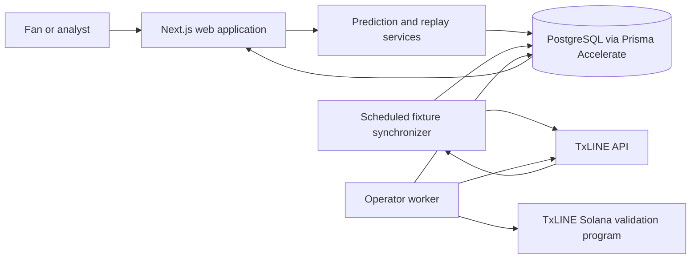
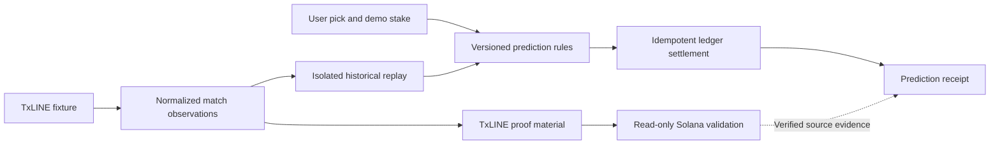

# Predict9ja

**Verifiable football prediction settlement powered by TxLINE.**

> Predict the match. Replay the action. Verify the result.

[](https://github.com/Quenine/predict9ja/actions/workflows/ci.yml)


[Live application](https://predict9ja-web.vercel.app) · [Demo video](https://youtu.be/6WjMjt-Paz8) · [Architecture](docs/architecture.md) · [TxLINE integration](docs/txline-integration.md) · [Operations](docs/operations.md)

[](https://youtu.be/6WjMjt-Paz8)

## Overview

Predict9ja is a mobile-first football prediction platform that turns TxLINE fixture and score data into transparent demo-credit predictions, deterministic settlement and auditable receipts.

Its flagship verified replay lets a user make a pick, replay England versus Argentina from stored TxLINE observations, and inspect the source evidence used to confirm the final result. The product separates sports-data provenance, application resolution rules and account settlement.

Predict9ja is a demonstration environment. Credits have no cash value, and the application does not accept deposits, withdrawals or real-money wagers.

## The problem

Most prediction interfaces show an outcome without exposing the path from source data to resolution. Users cannot easily inspect which match update confirmed the score, which rule resolved the prediction or whether settlement was applied consistently.

Predict9ja makes that path inspectable.

## What Predict9ja does

- Synchronizes a football fixture catalogue from TxLINE devnet.
- Presents match-result, total-goals and both-teams-to-score demo predictions.
- Creates isolated anonymous sessions with 10,000 demo credits.
- Replays stored historical observations in provider-sequence order.
- Resolves markets with versioned deterministic rules.
- Settles an append-only demo-credit ledger idempotently.
- Generates receipts with canonical integrity digests.
- Exposes TxLINE source evidence for the authoritative final observation.
- Validates exact source predicates against TxLINE's Solana devnet program through a read-only path.
- Provides a clearly labelled synthetic fallback for provider-independent demonstrations.

> Application quotes are fictional demonstration prices and are not TxLINE consensus odds.

## Architecture



The web application presents fixtures, replay controls, predictions and receipts. Worker commands own provider ingestion, historical imports, proof retrieval, verification and operator workflows. Framework-independent market rules live in the domain package, while PostgreSQL is the application system of record.

## Verified replay and settlement flow



The source proof validates the canonical match observation. Predict9ja's own rules and ledger produce the fictional application settlement. The proof does not validate the demo payout itself.

For the featured replay, sequence `962` is authoritative because it is the explicit final `game_finalised` observation with `finalised=true`. A later sequence, `963`, is retained for provenance but is non-final and cannot replace the authoritative final evidence.

## TxLINE integration

| Endpoint | Purpose |
| --- | --- |
| `POST /auth/guest/start` | Obtain an in-memory guest JWT |
| `GET /api/fixtures/snapshot` | Synchronize the devnet fixture catalogue |
| `GET /api/scores/snapshot/{fixtureId}` | Fetch controlled score snapshots |
| `GET /api/scores/historical/{fixtureId}` | Import ordered historical observations |
| `GET /api/scores/stream` | Consume score events through SSE |
| `GET /api/scores/stat-validation` | Retrieve proof material for exact score predicates |

SSE support is implemented but is not continuously hosted on Vercel. Historical replay uses observations already stored by the application. Provider credentials remain server-side. TxLINE odds are not currently consumed.

## Integrity model

1. TxLINE supplies fixture identity, participant orientation, ordered score observations and proof material.
2. Explicit `game_finalised` data establishes the authoritative final score.
3. Versioned application rules resolve each demonstration market.
4. Settlement writes a single ledger effect for each position.
5. A receipt records the resolution and settlement context with a canonical integrity digest.
6. Solana validation verifies the source observation predicates, not the fictional account payout.

## Technology

Next.js, React, TypeScript, Node.js 22, Turborepo, pnpm, PostgreSQL, Prisma, Prisma Accelerate, TxLINE HTTP/SSE APIs, Solana devnet, Vitest, Vercel and GitHub Actions.

## Repository structure

| Path | Responsibility |
| --- | --- |
| `apps/web` | Public Next.js application and API routes |
| `apps/worker` | TxLINE ingestion, replay and operator commands |
| `packages/domain` | Framework-independent prediction and resolution rules |
| `packages/txline` | TxLINE transport, authentication and normalization |
| `packages/verification` | Proof normalization, digests and Solana validation |
| `packages/db` | Prisma models, persistence, settlement and receipts |
| `docs` | Architecture, integration and operations documentation |
| `scripts` | Development, integration-test and runtime-smoke tooling |

## Getting started

### Prerequisites

- Node.js 22
- pnpm 10.12.1
- Docker
- PostgreSQL 16 through the included Compose configuration

```bash
corepack enable
pnpm install --frozen-lockfile
cp .env.example .env
pnpm db:up
pnpm db:deploy
pnpm db:seed
pnpm dev
```

The repository documents environment-variable names in `.env.example`. Keep local credentials outside source control.

## Common commands

```bash
pnpm dev
pnpm dev:all
pnpm db:up
pnpm db:deploy
pnpm db:seed
pnpm txline:sync-fixtures
pnpm txline:import-history --fixture-id <id>
pnpm txline:verify-proof --fixture-id <id> --sequence <seq> --stat-keys 1,2
pnpm markets:generate-all
pnpm markets:resolve --fixture-id <id> --dry-run
pnpm markets:settle --fixture-id <id>
```

## Testing

```bash
pnpm format:check
pnpm lint
pnpm typecheck
pnpm test
pnpm build
pnpm check:web-runtime
```

The test strategy combines unit tests, isolated PostgreSQL integration tests, production builds and route-level runtime smoke checks. CI runs the complete verification sequence on every push and pull request.

## Deployment

The public web application is deployed on Vercel. Runtime database traffic uses Prisma Accelerate, while migrations and seeds remain explicit administrative operations. A separate GitHub Actions workflow synchronizes the TxLINE fixture catalogue every 30 minutes and supports manual dispatch.

## Current scope and limitations

- Demo credits have no cash value and cannot be deposited, withdrawn, transferred or redeemed.
- There is no custody, escrow or real-value settlement.
- Fixed quotes are application demonstration prices, not TxLINE odds or price discovery.
- Catalogue coverage follows the current TxLINE devnet snapshot.
- The featured replay is historical and is not presented as a currently live match.
- SSE ingestion is implemented but is not continuously hosted on Vercel.
- TxLINE proof validation establishes source-data predicates; it does not prove the application payout.
- On-chain escrow and automated real-value settlement are outside this build.

## Documentation

- [Architecture](docs/architecture.md)
- [TxLINE integration](docs/txline-integration.md)
- [Operations](docs/operations.md)

## Acknowledgements

Predict9ja was built with TxLINE by TxODDS and its Solana-verifiable sports-data infrastructure. The project also acknowledges the Solana developer ecosystem and the TxODDS World Cup hackathon hosted on Superteam Earn.
