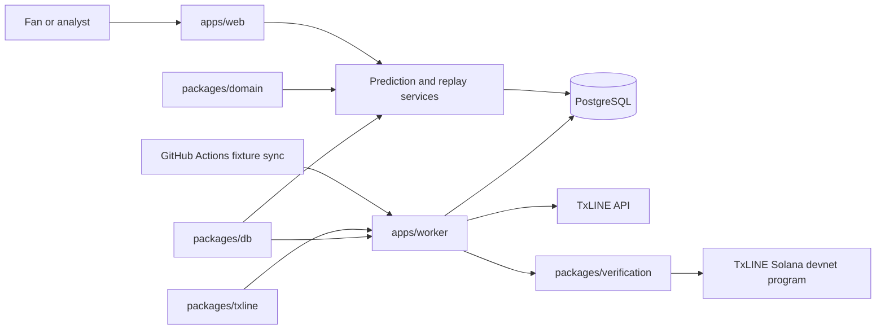
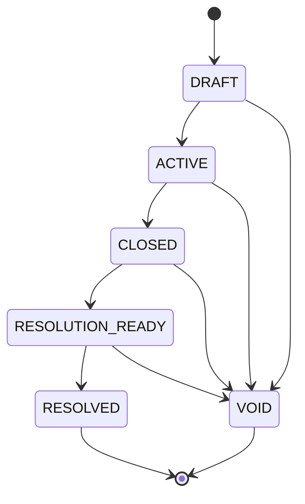
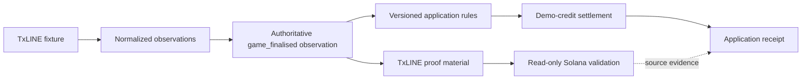

# Architecture

Predict9ja is a pnpm and Turborepo monorepo with explicit boundaries between user experience, provider integration, domain rules, persistence and verification.

## Component map

| Component               | Responsibility                                                                                                                    |
| ----------------------- | --------------------------------------------------------------------------------------------------------------------------------- |
| `apps/web`              | Public fixture catalogue, match pages, replay experience, demo predictions, portfolio, receipts and read-only diagnostics         |
| `apps/worker`           | TxLINE synchronization, score ingestion, historical imports, replay commands, proof retrieval, verification and market operations |
| `packages/domain`       | Pure market definitions, rule versions, score-to-outcome resolution and participant orientation                                   |
| `packages/txline`       | Guest authentication, HTTP/SSE transport, timeouts, typed errors and normalization                                                |
| `packages/verification` | Proof normalization, canonical digests, provider checks and Solana read-only validation                                           |
| `packages/db`           | Prisma client, normalized persistence, sessions, accounts, markets, ledger entries, settlement and receipts                       |

PostgreSQL is the application system of record. Vercel uses Prisma Accelerate as the serverless runtime transport, while administrative migrations and seed operations use the normal PostgreSQL connection.

## Data boundaries

TxLINE data is normalized before it enters application workflows. The database stores bounded records rather than unrestricted provider payloads. Fixture identity, participant orientation, provider sequence, provider timestamp, action, phase and supported score statistics remain explicit fields.

Participant 1 and Participant 2 are preserved independently of the displayed home and away order. This prevents score inversion when provider ordering differs from the presentation order.

Canonical observations are immutable inputs. Historical replay operates on a separate replay state and does not rewrite provider sequences, canonical projections or settlement authority.

## Market lifecycle

Predict9ja creates three ordered demonstration market templates for eligible fixtures:

- Match result: `HOME`, `DRAW`, `AWAY`
- Total goals 2.5: `OVER`, `UNDER`
- Both teams to score: `YES`, `NO`

Rules are versioned as `match-result@1`, `total-goals-2.5@1` and `both-teams-to-score@1`.

`RESOLUTION_READY` requires an explicit normalized `game_finalised` observation with both participant scores. A finished-looking phase by itself is not sufficient.

## Settlement and ledger integrity

Each anonymous browser session owns an independent demo account. A new session receives 10,000 integer credits through a `SESSION_GRANT` ledger entry.

The account balance is a transactional projection of an append-only ledger. Supported entries include session grants, position purchases, settlement payouts, void refunds and explicit resets. Unique references prevent duplicate payouts and refunds. A settlement operation updates the ledger and balance atomically.

Quotes use integer basis points and positions use microshares so the same inputs always produce the same bounded result. Potential payouts round down rather than upward.

## Receipt integrity

Resolution creates a bounded application receipt containing the fixture, market, rule version, final observation, provider sequence and timestamp, participant scores and orientation, resolution state, settlement state and source-evidence status.

A SHA-256 digest is calculated over canonical field ordering. This digest protects the application receipt from accidental mutation; it is not a TxLINE proof and it is not an on-chain settlement record.

## Source evidence and settlement provenance

The source proof validates the canonical match observation. Predict9ja's rules and ledger produce the fictional application settlement. The proof does not validate the payout itself.

## Authority policy for the featured replay

The England–Argentina example uses TxLINE fixture `18241006`.

Sequence `962` is authoritative because it contains:

- score 1–2;
- action `game_finalised`;
- `finalised=true`;
- the exact final observation used for source validation.

Sequence `963` is retained because it arrived later, but it is non-final. Recency alone cannot override explicit finalisation. It is therefore not used as settlement evidence.

## Anonymous-session boundary

The web session token is generated as an opaque random value. The database stores only a secret-bound SHA-256 hash, while the browser receives the raw token in an HttpOnly, SameSite cookie that is secure in production.

Purchase requests do not accept an account identifier from the client. The server resolves the account from the session cookie. Sessions collect no name, email address or phone number.

## Verification boundary

Solana validation is pinned to the configured network, program, IDL and daily-scores account derivation. Validation is read-only and does not submit a transaction.

For fixture `18241006`, sequence `962`, stat keys `1` and `2`, the normalized proof is classified as verified final match data without a linked real-market receipt. This classification deliberately prevents source-data verification from being presented as proof of a fictional application payout.
